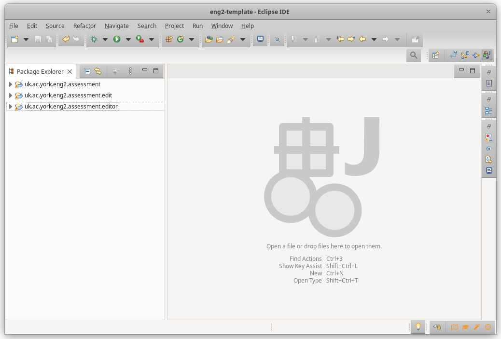
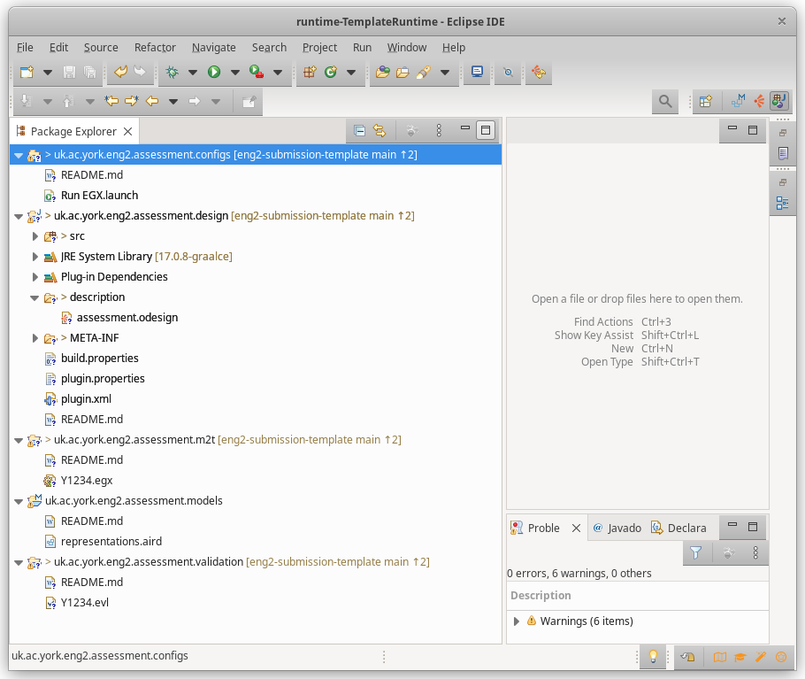

# 2023/24 ENG2 submission template

This is a template repository with a recommended structure for your submission to the assessment of the ENG2 module, in its 2023/24 edition.

The repository is structured according to your assessment specification, and it is largely divided into:

* A report in PDF format: `Y1234.pdf`, where `Y1234` is your examination number.
* A folder called `microservices` with the implementations of your microservices and command-line clients.
* A folder called `modeling` with your Eclipse-based modelling language and models.

See the subsections below and the rest of the `README.md` files in this repository for more details.

Remember that you must not identify yourself anywhere in your submission!

## Report (in PDF format)

While the repository includes a source `.docx` file as an example, you can produce the PDF with any software you like.

## Microservices

You may develop these microservices using Eclipse (as taught in the module), or using another IDE of your choosing.

Regardless of the IDE you used, we expect you to provide the full Gradle projects, so we can build them by running the Gradle `build` task.
Please include the instructions for how to build your microservices and their Docker images in your report.

The simplest option is to have one Gradle project per microservice/client.
Alternatively, you could look into [Gradle multi-project builds](https://docs.gradle.org/current/userguide/multi_project_builds.html) if you'd like to reuse code across projects.

Note that if you are an ENG2-M student, you will also need to include the hashtag recommendation microservice.

## Modeling language and models

You will need Eclipse to do this part. For 2023/24, the easiest approach is to install Eclipse with Epsilon 2.4 as mentioned [in this page](https://eclipse.dev/epsilon/download/).

For modeling, we suggest developing your metamodel in your main Eclipse instance, and doing the rest of the tasks in a nested Eclipse instance.

Your main Eclipse instance would include the metamodel project and its generated `.edit` and `.editor` projects:

The nested Eclipse instance that you launch from the main instance would include the rest of the modeling projects:

You should rename the projects and their folders, changing `y1234` to your examination number.
To do this:

1. Switch to the Java perspective from the Window menu, selecting "Perspective" and then "Other...", and choosing "Java".
1. Do this on each project from the "Package Explorer" view:
   1. Right-click on it, and select "Refactor - Rename..." to rename the project.
   1. Right-click on it again, and select "Refactor - Move..." to rename its folder so it matches the new project name.

In addition, for the projects based on your metamodel, since you will need to rename the `.emf` file and change its contents, you should delete and regenerate the `src` folders and `.ecore` and `.genmodel` files.

Putting everything together, we recommend doing this to get started:

1. Open Eclipse.
1. Import the metamodel, `.edit` and `.editor` projects.
1. Rename the projects and their folders to suit your examination number.
1. Delete the `src` folders from these three projects, as well as the `.ecore` and `.genmodel` file.
1. Rename the `Y1234.emf` file to suit your examination number, and populate it with your metamodel.
1. Regenerate the `.ecore` and `.genmodel` files, as well as the source code of the tree-based editors.
1. Run a nested Eclipse instance from the metamodel project.
1. Import the rest of the modeling projects in the nested Eclipse instance.
1. Rename the imported projects and their folders to suit your examination number.
